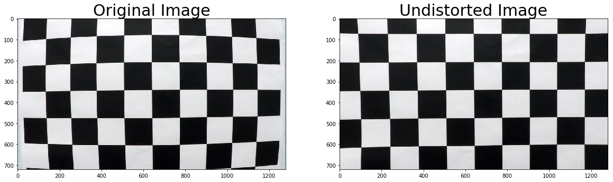
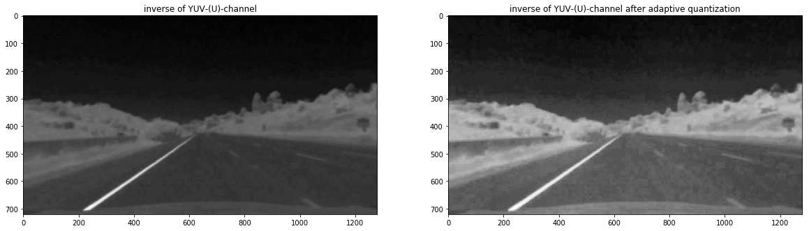
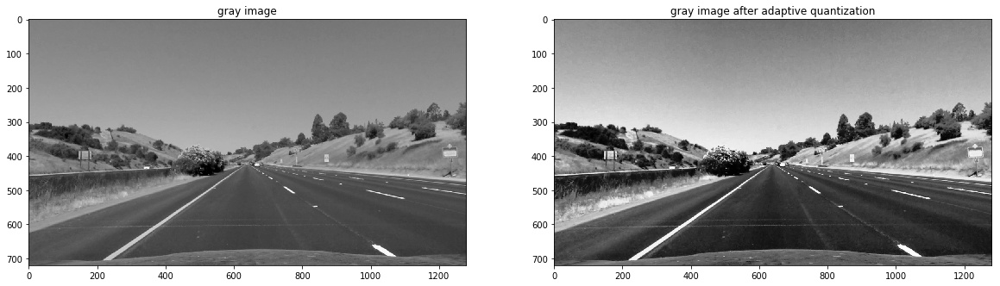
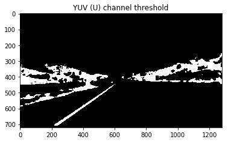
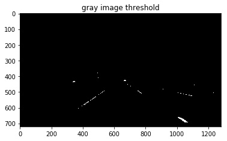
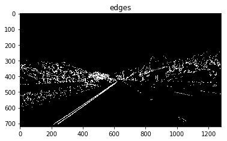
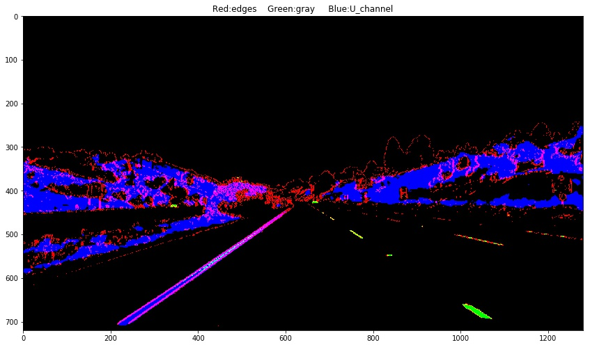
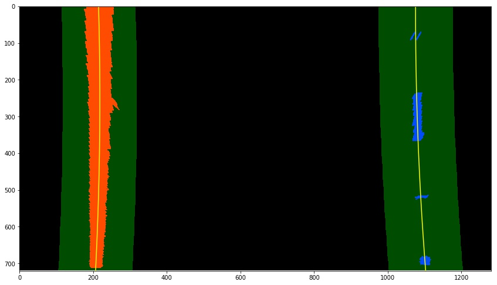
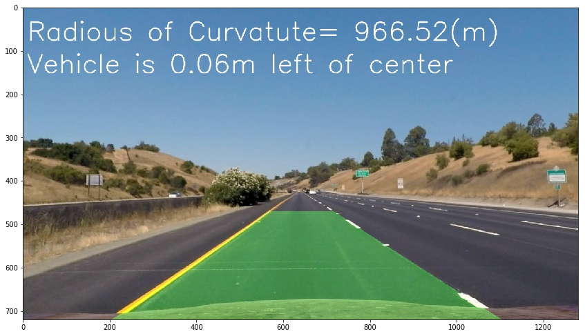

# **Advanced Lane Finding Project**

The goalsof this project are the following:

* Compute the camera calibration matrix and distortion coefficients given a set of chessboard images.
* Apply a distortion correction to raw images.
* Use color transforms, gradients to create a thresholded binary image.
* Apply a perspective transform to rectify binary image ("birds-eye view").
* Detect lane pixels and fit to find the lane boundary.
* Determine the curvature of the lane and vehicle position with respect to center.
* Warp the detected lane boundaries back onto the original image.
* Output visual display of the lane boundaries and numerical estimation of lane curvature and vehicle position.


## [Rubric](https://review.udacity.com/#!/rubrics/571/view) Points

### Here I will consider the rubric points individually and describe how I addressed each point in my implementation.

---

### Writeup / README

#### 1. Provide a Writeup / README that includes all the rubric points and how you addressed each one.  You can submit your writeup as markdown or pdf.  [Here](https://github.com/udacity/CarND-Advanced-Lane-Lines/blob/master/writeup_template.md) is a template writeup for this project you can use as a guide and a starting point.

You're reading it!

### Camera Calibration

#### 1. Briefly state how you computed the camera matrix and distortion coefficients. Provide an example of a distortion corrected calibration image.

The code for this step is contained in code cell (2,3) of the IPython notebook.

I start by preparing "object points", which will be the (x, y, z) coordinates of the chessboard corners in the world. Here I am assuming the chessboard is fixed on the (x, y) plane at z=0, such that the object points are the same for each calibration image.  Thus, `objp` is just a replicated array of coordinates, and `objpoints` will be appended with a copy of it every time I almostly successfully detect chessboard corners in a test image.  `imgpoints` will be appended with the (x, y) pixel position of each of the corners in the image plane with each successful chessboard detection.

I then used the output `objpoints` and `imgpoints` to compute the camera calibration and distortion coefficients using the `cv2.calibrateCamera()` function.  I applied this distortion correction to the test image using the `cv2.undistort()` function and obtained this result:



### Pipeline (single images)

#### 1. Provide an example of a distortion-corrected image.

To demonstrate this step, I will describe how I apply the distortion correction to one of the test images like this one:


I loaded the camera matrix and distance which I get from them camera calibration step, then using these parameters I applied  `cv2.undistort` to the image to get the undistorted image (code cell 7)

#### 2. Describe how (and identify where in your code) you used color transforms, gradients or other methods to create a thresholded binary image.  Provide an example of a binary image result.

I used a combination of color and gradient thresholds to generate a binary image (code cell 8),(code cell 5 line 196).

I generate binary image from 3 channels
* YUV-(U)- channel
* gray channel
* gradient channel oring with the last 2 channels

For the first 2 channels I used adaptive equalization to make the algorithm more reliable on lightness changes.

Here's anotated images output for each step.

the result of the inverse of U channel and the quantization of it:


<br><br>

the result of the grayscale image and the quantization of it:


<br><br>

the binary image from U channel:


<br><br>

the binary image from grayscale:


<br><br>

the binary image from gradients:


<br><br>

the the combined binary image:




#### 3. Describe how (and identify where in your code) you performed a perspective transform and provide an example of a transformed image.

The code for my perspective transform in code cell (9).
I used `cv2.getPerspectiveTransform()`,`cv2.getPerspectiveTransform()` and `cv2.warpPerspective()` to wrap and unwrap the images.

I chose the hardcode the source and destination points in the following manner:

```python
src=np.float32(
    [[200,image.shape[0]-1],
    [565,470],
    [722,470],
    [1100,image.shape[0]-1]
        ])
dst=np.float32(
    [[200,image.shape[0]-1],
    [200,0],
    [1100,0],
    [1100,image.shape[0]-1]
        ])
```

This resulted in the following source and destination points:

| Source        | Destination   |
|:-------------:|:-------------:|
| 200,719     |200,719       |
| 565,470     | 200,0     |
| 722,470  | 1100,0    |
| 1100,719  | 1100,719     |

I verified that my perspective transform was working as expected by drawing the `src` and `dst` points onto a test image and its warped counterpart to verify that the lines appear parallel in the warped image.


#### 4. Describe how (and identify where in your code) you identified lane-line pixels and fit their positions with a polynomial?

I used a 9 windows to get the pixels of the lanes , and I get those windows from the histogram of the bottom half of the wraped image.

Then ,by curve fitting for the lane pixels with 2nd degree polynomial function, I get the two lane lines kinda like this(code cell 11,12,13):



#### 5. Describe how (and identify where in your code) you calculated the radius of curvature of the lane and the position of the vehicle with respect to center.

* Curvature: I considered these curves as a circles and the curvature is the radious of this circle.
And I followed this tutorial to get the equations of calculating the curvature http://www.intmath.com/applications-differentiation/8-radius-curvature.php ,I used the 2nd degree polynomial lines data in those equations.

* Position of the vehicle with respect to center: after I  unwrap the image I get the most bottom left and the most  bottom right points on the lanes, Then I use those points to get the center of the lane and distance from the center of the lane to the center of the camera.

* I put in my consideration the pixel-meter transformation in these calculations (code cell 15).

#### 6. Provide an example image of your result plotted back down onto the road such that the lane area is identified clearly.

I implemented this step in code cell(14 , 15).  Here is an example of my result on a test image:



---

### Pipeline (video)

#### 1. Provide a link to your final video output.  Your pipeline should perform reasonably well on the entire project video (wobbly lines are ok but no catastrophic failures that would cause the car to drive off the road!).


for the video frames , once I had a high confidence frame I just add one window in the next frame .

I also impelement a low pass filter for every 3 frames.

Here's a [link to my video result](./project_video.mp4)

And the challenge video [here](./challenge_video.mp4)

---

### Discussion

#### 1. Briefly discuss any problems / issues you faced in your implementation of this project.  Where will your pipeline likely fail?  What could you do to make it more robust?

##### This piplne may fail:
* In the change of brightness like in the hard challenge video  m and we can solve that by tuning the adaptive quantization, I used it and it gave me better performance.
* big curves like in the hard challenge video.
* if there is a vehicle on the lane and that could be solved by using the detecting vehicle project to remove the vehicle from the area of interest.
